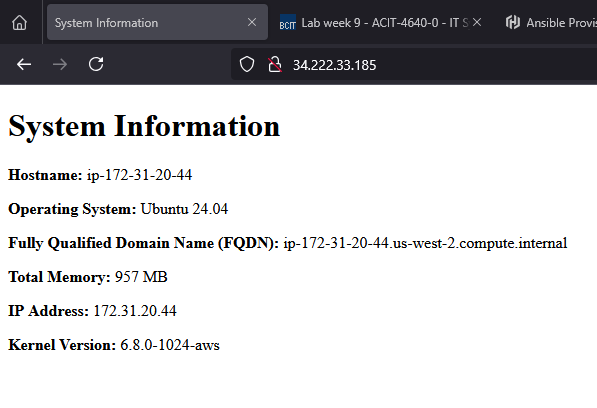

# lab-week9-packer
# Instance

# Commands
1. Generate SSH key and copy to AWS
2. Initialize Packer
> working directory: ./
```bash
packer init
```
3. Build images
```bash
packer build packer
```
3. Initialize Terraform
> working directory ./Terraform
```bash
terraform init
```
4. Review Terraform Build
```bash
terraform plan
```
5. Build Infrastructure
```bash
terraform apply
```